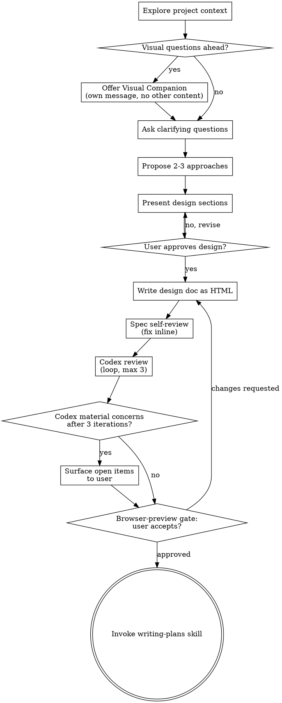

# Brainstorming Ideas Into HTML Designs

Help turn ideas into fully formed designs through natural collaborative dialogue, then capture the validated design as a **distinctive, self-contained HTML document** (not a markdown spec), styled with the `frontend-design` skill.

Start by understanding the current project context, then ask questions one at a time to refine the idea. Once you understand what you're building, present the design and get user approval.

<HARD-GATE>
Do NOT invoke any implementation skill, write any code, scaffold any project, or take any implementation action until you have presented a design and the user has approved it. This applies to EVERY project regardless of perceived simplicity.
</HARD-GATE>

## Anti-Pattern: "This Is Too Simple To Need A Design"

Every project goes through this process. A todo list, a single-function utility, a config change — all of them. "Simple" projects are where unexamined assumptions cause the most wasted work. The design can be short (a few sentences for truly simple projects), but you MUST present it and get approval.

## Checklist

You MUST create a task for each of these items and complete them in order:

1. **Explore project context** — check files, docs, recent commits
2. **Offer visual companion** (if topic will involve visual questions) — this is its own message, not combined with a clarifying question. See the Visual Companion section below.
3. **Ask clarifying questions** — one at a time, understand purpose/constraints/success criteria
4. **Propose 2-3 approaches** — with trade-offs and your recommendation
5. **Present design** — in sections scaled to their complexity, get user approval after each section
6. **Write design doc as HTML** — use the `frontend-design` skill to render the approved design as a distinctive, self-contained styled `.html` file; save to `docs/mySuperpower/specs/YYYY-MM-DD-<topic>-design.html` and commit
7. **Spec self-review** — quick inline check for placeholders, contradictions, ambiguity, scope (see below)
8. **Codex review (≤3 iterations)** — have Codex review the HTML design doc and address actionable feedback (see below)
9. **Browser-preview gate (user acceptance)** — user reviews the rendered HTML in a browser; their acceptance is the gate
10. **Transition to implementation** — invoke the `writing-plans` skill to create an implementation plan

## Process Flow

**The terminal state is invoking writing-plans.** `frontend-design` is used only as a styling sub-skill while writing the HTML design doc (step 6) — it is NOT an implementation step. Do NOT invoke mcp-builder or any other implementation skill, and do NOT treat `frontend-design` as the next phase. The ONLY skill you invoke to move past the design is `writing-plans`.

> **Companion skill:** `writing-plans` is the plans-generating companion in this suite. It turns the approved HTML design into a self-contained HTML implementation plan.

## The Process

**Understanding the idea:**

- Check out the current project state first (files, docs, recent commits)
- Before asking detailed questions, assess scope: if the request describes multiple independent subsystems (e.g., "build a platform with chat, file storage, billing, and analytics"), flag this immediately. Don't spend questions refining details of a project that needs to be decomposed first.
- If the project is too large for a single spec, help the user decompose into sub-projects: what are the independent pieces, how do they relate, what order should they be built? Then brainstorm the first sub-project through the normal design flow. Each sub-project gets its own design → plan → implementation cycle.
- For appropriately-scoped projects, ask questions one at a time to refine the idea
- Prefer multiple choice questions when possible, but open-ended is fine too
- Only one question per message - if a topic needs more exploration, break it into multiple questions
- Focus on understanding: purpose, constraints, success criteria

**Exploring approaches:**

- Propose 2-3 different approaches with trade-offs
- Present options conversationally with your recommendation and reasoning
- Lead with your recommended option and explain why

**Presenting the design:**

- Once you believe you understand what you're building, present the design
- Scale each section to its complexity: a few sentences if straightforward, up to 200-300 words if nuanced
- Ask after each section whether it looks right so far
- Cover: architecture, components, data flow, error handling, testing
- Be ready to go back and clarify if something doesn't make sense

**Design for isolation and clarity:**

- Break the system into smaller units that each have one clear purpose, communicate through well-defined interfaces, and can be understood and tested independently
- For each unit, you should be able to answer: what does it do, how do you use it, and what does it depend on?
- Can someone understand what a unit does without reading its internals? Can you change the internals without breaking consumers? If not, the boundaries need work.
- Smaller, well-bounded units are also easier for you to work with - you reason better about code you can hold in context at once, and your edits are more reliable when files are focused. When a file grows large, that's often a signal that it's doing too much.

**Working in existing codebases:**

- Explore the current structure before proposing changes. Follow existing patterns.
- Where existing code has problems that affect the work (e.g., a file that's grown too large, unclear boundaries, tangled responsibilities), include targeted improvements as part of the design - the way a good developer improves code they're working in.
- Don't propose unrelated refactoring. Stay focused on what serves the current goal.

## After the Design

**Documentation (HTML output):**

Render the validated design as a **distinctive, self-contained HTML document** and save it to `docs/mySuperpower/specs/YYYY-MM-DD-<topic>-design.html`. (User preferences for spec location override this default.)

- **REQUIRED SUB-SKILL:** Use `frontend-design` to style the document **body** — section headings, prose, tables, code blocks, spacing, and tasteful CSS-only motion — **within the fixed masthead and palette** defined by the template (see below). It must NOT restyle the header or introduce off-palette colors; it harmonizes the body with the header using the same CSS variables. Readability of the spec comes first.
- **Hard constraint — fully self-contained, no network:** Everything inline in one `.html` file. All CSS in a single `<style>` block. **No external fonts, no Google Fonts, no CDN libraries, no remote images, no `<link>` or external `<script>` references.** Use web-safe / system font stacks only (e.g. Georgia/Times serif pairings, `system-ui` sans, monospace for code). The file MUST render identically when opened from `file://` with no internet access. **This constraint overrides `frontend-design`'s default preference for distinctive web fonts** — get distinctiveness from layout, color, and composition instead.
- **Fixed masthead + structure contract:** Start from `templates/design-doc-template.html`. Its header block and CSS palette are **FIXED** — reproduce them as-is so every spec shares the same editorial identity: warm-paper background, Georgia display title, maroon eyebrow `Spec · Design`, bold-italic subtitle, and a mono meta-card with an amber status pill. `frontend-design` styles only the body, using the template's CSS variables.
- **Header fields:** `{{TITLE}}` (design title), `{{SUBTITLE}}` (one-line scope summary — the bold-italic line), `{{DATE}}` (today), `{{BRANCH}}` (intended feature/fix branch, e.g. `feature/<topic>`, or `TBD`), `{{SOURCE}}` (one line on what prompted this work). The eyebrow is fixed `Spec · Design`; the status pill is fixed `Design — Awaiting Plan + Impl` for a freshly written spec.
- Then render the design body, scaled to complexity: Overview, Chosen Approach, Architecture, Components, Data Flow, Error Handling, Testing.
- Create the `docs/mySuperpower/specs/` directory if it does not exist
- Use elements-of-style:writing-clearly-and-concisely skill if available
- Commit the HTML design document to git

**Spec Self-Review:**
After writing the HTML doc, look at it with fresh eyes:

1. **Placeholder scan:** Any leftover `{{...}}` placeholders, "TBD", "TODO", incomplete sections, or vague requirements? Fix them.
2. **Internal consistency:** Do any sections contradict each other? Does the architecture match the feature descriptions?
3. **Scope check:** Is this focused enough for a single implementation plan, or does it need decomposition?
4. **Ambiguity check:** Could any requirement be interpreted two different ways? If so, pick one and make it explicit.
5. **Self-contained check:** No external CSS/JS/font/image references, no `<link>` or CDN URLs; web-safe/system font stacks only; all CSS inline; valid HTML structure; renders from `file://` offline.
6. **Masthead check:** Header reproduced from the template — fixed eyebrow `Spec · Design`, title, subtitle, meta-card (Date/Branch/Status/Source) with amber status pill and maroon accent; body uses the template's palette variables (no off-palette accent colors).

Fix any issues inline. No need to re-review — just fix and move on.

**Codex Review (max 3 iterations):**
After the self-review passes, have Codex review the HTML design doc before the user reviews it:

1. Dispatch Codex via the `codex:rescue` skill (the `codex:codex-rescue` agent), pointing it at the HTML file path, and ask it to return concrete, actionable feedback on the design.
   - **Fallback when Codex is unavailable:** if Codex cannot be reached or does not respond, dispatch a general-purpose subagent using `spec-document-reviewer-prompt.md` (in this skill directory) to perform the equivalent review instead. The 3-iteration cap applies either way.
2. Address Codex's actionable feedback by revising the HTML doc, then re-submit to Codex.
3. **Cap this loop at 3 iterations total.** If material concerns remain unresolved after the 3rd iteration, STOP looping and surface the open items to the user for a decision.
4. Proceed to the user review gate only after the loop concludes — either Codex has no further material feedback, or the open items have been surfaced to the user.

**Browser-Preview Gate (user acceptance) — HARD STOP:**
After the Codex review loop concludes, **automatically open the finished HTML design in the browser, then STOP.** Do NOT invoke `writing-plans`, and do NOT take any further step, until the user **explicitly agrees** to the HTML spec. Reaching this gate is not acceptance; silence is not acceptance; only an explicit approval from the user (e.g. "yes", "approved", "looks good") passes the gate. Because the doc is self-contained, it renders correctly straight from disk.

1. **Open the rendered doc in the browser.** Always do BOTH:
   - **Print the clickable file URL** — absolute path, forward slashes: `file:///C:/.../<file>.html`. This is the reliable fallback; it works regardless of OS, shell, or file associations.
   - **Best-effort auto-open with a QUOTED absolute path** (an unquoted path breaks on spaces):
     - Windows / PowerShell: `Start-Process "<absolute path>"`
     - Windows / cmd or bash: `cmd /c start "" "<absolute path>"`
     - macOS: `open "<absolute path>"`
     - Linux: `xdg-open "<absolute path>"`
   - Prefer these forms — they honor the user's **default browser**. Do NOT rely on the bare `.html` association (`ftype`/`iexplore`): on some Windows machines it still points at the removed Internet Explorer and will fail. If auto-open errors or opens the wrong app, tell the user to click the printed `file://` link.
2. Ask:
   > "HTML design doc written and committed to `<path>`. Open it in your browser to review — let me know if you want any changes before we move on to the implementation plan."
3. Wait for the user's response. If they request changes, make them and re-run the self-review and Codex review loops, then re-present for preview.
4. **Only an explicit user approval passes the gate.** Once the user approves, invoke `writing-plans`. If they request changes, revise, re-run the self-review + Codex loops, **re-open the doc in the browser**, and wait again. Never continue on silence or assumption. (This accepted spec is the "browser-preview gate" the downstream skills refer to.)

**Implementation:**

- Invoke the `writing-plans` skill to create a detailed implementation plan
- Do NOT invoke any other skill. `writing-plans` is the next step.

## Key Principles

- **One question at a time** - Don't overwhelm with multiple questions
- **Multiple choice preferred** - Easier to answer than open-ended when possible
- **YAGNI ruthlessly** - Remove unnecessary features from all designs
- **Explore alternatives** - Always propose 2-3 approaches before settling
- **Incremental validation** - Present design, get approval before moving on
- **Be flexible** - Go back and clarify when something doesn't make sense
- **Distinctive but readable** - Use `frontend-design` for genuine craft, but a spec's readability always wins over visual flourish
- **Self-contained output** - The HTML must render standalone with no external dependencies (inline CSS, web-safe fonts, no network)

## Visual Companion

A browser-based companion for showing mockups, diagrams, and visual options during brainstorming. Available as a tool — not a mode. Accepting the companion means it's available for questions that benefit from visual treatment; it does NOT mean every question goes through the browser.

**Offering the companion:** When you anticipate that upcoming questions will involve visual content (mockups, layouts, diagrams), offer it once for consent:
> "Some of what we're working on might be easier to explain if I can show it to you in a web browser. I can put together mockups, diagrams, comparisons, and other visuals as we go. This feature is still new and can be token-intensive. Want to try it? (Requires opening a local URL)"

**This offer MUST be its own message.** Do not combine it with clarifying questions, context summaries, or any other content. The message should contain ONLY the offer above and nothing else. Wait for the user's response before continuing. If they decline, proceed with text-only brainstorming.

**Per-question decision:** Even after the user accepts, decide FOR EACH QUESTION whether to use the browser or the terminal. The test: **would the user understand this better by seeing it than reading it?**

- **Use the browser** for content that IS visual — mockups, wireframes, layout comparisons, architecture diagrams, side-by-side visual designs
- **Use the terminal** for content that is text — requirements questions, conceptual choices, tradeoff lists, A/B/C/D text options, scope decisions

A question about a UI topic is not automatically a visual question. "What does personality mean in this context?" is a conceptual question — use the terminal. "Which wizard layout works better?" is a visual question — use the browser.

If they agree to the companion, read the detailed guide before proceeding:
`visual-companion.md` (in this skill directory)
