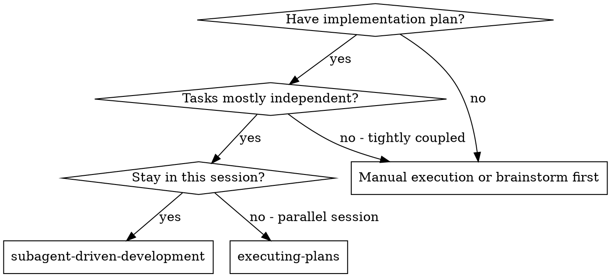
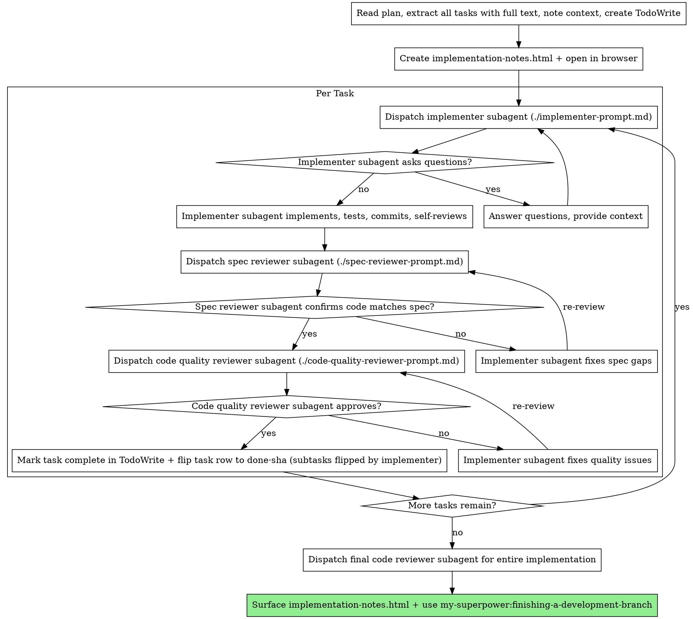

# Subagent-Driven Development (HTML notes)

Execute plan by dispatching fresh subagent per task, with two-stage review after each: spec compliance review first, then code quality review. Throughout, keep a running **implementation-notes.html** for the owner.

**Why subagents:** You delegate tasks to specialized agents with isolated context. By precisely crafting their instructions and context, you ensure they stay focused and succeed at their task. They should never inherit your session's context or history — you construct exactly what they need. This also preserves your own context for coordination work.

**Core principle:** Fresh subagent per task + two-stage review (spec then quality) = high quality, fast iteration

**Continuous execution:** Do not pause to check in with your human partner between tasks. Execute all tasks from the plan without stopping. The only reasons to stop are: BLOCKED status you cannot resolve, ambiguity that genuinely prevents progress, or all tasks complete. "Should I continue?" prompts and progress summaries waste their time — they asked you to execute the plan, so execute it.

## Implementation Notes (HTML) — the running record

Implementation begins **after the plan's browser-preview gate** — i.e., after the owner reviewed the HTML plan in a browser (in `writing-plans`) and accepted it. Kick off implementation with this intent — and honor it whether or not it is typed verbatim:

> implement &lt;PLAN/SPEC&gt; and while you do, keep a running implementation-notes.html
> file with decisions you had to make that weren't in the spec, things you had to
> change, tradeoffs you had to make, or anything else I should know

**Rules for the notes file:**
- It MUST be **HTML** (`.html`), NOT Markdown — self-contained and styled in the same editorial identity as the spec/plan. Start from `templates/implementation-notes-template.html` in this skill directory: its **fixed masthead + palette** (warm paper, Georgia display, maroon eyebrow `Notes · Implementation`, mono meta-card, on-palette table pills + Decisions cards) are reproduced as-is; `frontend-design` may refine the card bodies within that palette (no off-palette accents).
- Save to `docs/mySuperpower/implementation-notes/<YYYY-MM-DD>-<name>.html` (the folder already conveys "implementation-notes", so do NOT repeat it in the filename). Create the folder if it doesn't exist.
- **Self-contained, no network:** all CSS inline, web-safe/system fonts only, no external fonts/CDN/images/`<link>`/external `<script>`. Must render from `file://` offline.
- **Launch the browser as soon as the file is ready.** Use the file's **ABSOLUTE path** — a relative path makes the open silently fail (a likely cause of "it didn't open"). Do BOTH:
  - **Print the clickable URL** on its own line — `file:///C:/…/<file>.html` (absolute, forward slashes). This is the guaranteed fallback.
  - **Best-effort auto-open with a QUOTED ABSOLUTE path:** Windows `powershell -NoProfile -Command 'Start-Process "<abs path>"'` (or `cmd /c start "" "<abs path>"`), macOS `open "<abs path>"`, Linux `xdg-open "<abs path>"`. Don't rely on the bare `.html` association (it may point at the removed Internet Explorer).
  - If you can't confirm a window opened, tell the owner to click the printed link. **Tell them to keep that tab VISIBLE (side-by-side, not backgrounded)** — browsers throttle background tabs, so the auto-refresh only fires when it's the active tab; otherwise they must refresh manually.
- **The notes have TWO live regions** (no generic activity log): (1) a **Task Status table** — one task-row per plan task with its TDD **subtask** rows beneath (write failing test / implement / commit); and (2) a **Decisions & Deviations** card section — maroon-tagged cards for substantive off-spec decisions, plan deviations, important fixes, cross-task interactions, tradeoffs, or anything else the owner should know. At setup YOU (controller) build the table (all rows `pending`) and the empty Decisions section from the plan.
- **Updated LIVE, in sync with the TodoWrite list:** since you're blocked while a subagent runs, the **implementer flips ITS task's SUBTASK rows** (pending → in progress → `&check; done`) the moment each TDD step lands, AND appends a **Decisions & Deviations** card for any substantive off-spec item — so fill the notes file path into the implementer's prompt. YOU (controller) flip that task's **top-level** row to `done · <short-sha>` after its two-stage review passes, confirm the implementer's cards landed (from its "Off-Spec Notes"), and may add your own context cards (e.g. a `Pre-impl · Context` card). Edit in place; never add `<style>`/fonts/scripts/external refs.
- **Surface it to the owner alongside the final result** — re-point them to the open browser tab, flip the meta-card status pill to `Implementation — Complete`, and remove the `<meta refresh>` (the live phase is over).

## When to Use



**vs. Executing Plans (parallel session):**
- Same session (no context switch)
- Fresh subagent per task (no context pollution)
- Two-stage review after each task: spec compliance first, then code quality
- Faster iteration (no human-in-loop between tasks)

## The Process

**Setup — do this ONCE, before the per-task loop, in this order:**

1. Read the plan once and extract ALL tasks with their full text + context.
2. **Create a TodoWrite list containing every task.** This is the visible task list in the Claude terminal — create it **up front** so the user can watch progress. Mark each task `in_progress` when you start it and `completed` only after its two-stage review passes. **This is REQUIRED and is separate from the implementation-notes.html** — the notes file does NOT replace the TodoWrite list; you maintain both.
3. Create the `implementation-notes.html` and open it in the browser (see "Implementation Notes (HTML)" above).

Then run the per-task loop:



## Model Selection

Use the least powerful model that can handle each role to conserve cost and increase speed.

**Mechanical implementation tasks** (isolated functions, clear specs, 1-2 files): use a fast, cheap model. Most implementation tasks are mechanical when the plan is well-specified.

**Integration and judgment tasks** (multi-file coordination, pattern matching, debugging): use a standard model.

**Architecture, design, and review tasks**: use the most capable available model.

**Task complexity signals:**
- Touches 1-2 files with a complete spec → cheap model
- Touches multiple files with integration concerns → standard model
- Requires design judgment or broad codebase understanding → most capable model

## Handling Implementer Status

Implementer subagents report one of four statuses. Handle each appropriately:

**DONE:** Proceed to spec compliance review.

**DONE_WITH_CONCERNS:** The implementer completed the work but flagged doubts. Read the concerns before proceeding. If the concerns are about correctness or scope, address them before review. If they're observations (e.g., "this file is getting large"), note them and proceed to review.

**NEEDS_CONTEXT:** The implementer needs information that wasn't provided. Provide the missing context and re-dispatch.

**BLOCKED:** The implementer cannot complete the task. Assess the blocker:
1. If it's a context problem, provide more context and re-dispatch with the same model
2. If the task requires more reasoning, re-dispatch with a more capable model
3. If the task is too large, break it into smaller pieces
4. If the plan itself is wrong, escalate to the human

**Never** ignore an escalation or force the same model to retry without changes. If the implementer said it's stuck, something needs to change.

**In every status**, confirm the implementer's live entries landed in `implementation-notes.html` and add anything missing from its "Off-Spec Notes" (decisions / deviations / tradeoffs / things-to-know) — even a BLOCKED task may have surfaced a decision worth recording.

## Prompt Templates

- `./implementer-prompt.md` - Dispatch implementer subagent. **Fill in the implementation-notes.html path** in the prompt so the implementer updates the notes LIVE (progress + decisions) as it works; it also reports Off-Spec Notes for your verification.
- `./spec-reviewer-prompt.md` - Dispatch spec compliance reviewer subagent
- `./code-quality-reviewer-prompt.md` - Dispatch code quality reviewer subagent

## Example Workflow

```
You: I'm using Subagent-Driven Development (HTML notes) to execute this plan.

[Read plan file once: docs/mySuperpower/plans/2026-05-24-feature.html]
[Extract all 5 tasks with full text and context]
[Create TodoWrite with all tasks]
[Create docs/mySuperpower/implementation-notes/2026-05-24-feature.html from the
 template, styled via frontend-design, self-contained]

Task 1: Hook installation script

[Dispatch implementation subagent with full task text + context]
Implementer: "Before I begin - should the hook be installed at user or system level?"
You: "User level (~/.config/superpowers/hooks/)"
Implementer: [implements, tests 5/5, self-review found missing --force flag, added, committed]
  Off-Spec Notes: Decision — installed at user level per controller; chose ~/.config
  over ~/.local/share (XDG config, not data). Tradeoff: none.

[Dispatch spec compliance reviewer] -> ✅ compliant
[Dispatch code quality reviewer] -> ✅ approved
[Mark Task 1 complete in TodoWrite]
[Append Task 1 Off-Spec Notes as a "decision" entry in implementation-notes.html]

... (repeat per task) ...

[After all tasks] [Dispatch final code-reviewer] -> ready to merge
[Surface implementation-notes.html to the owner alongside the result]
Done!
```

## Advantages

**vs. Manual execution:**
- Subagents follow TDD naturally
- Fresh context per task (no confusion)
- Parallel-safe (subagents don't interfere)
- Subagent can ask questions (before AND during work)

**vs. Executing Plans:**
- Same session (no handoff)
- Continuous progress (no waiting)
- Review checkpoints automatic

**Quality gates:**
- Self-review catches issues before handoff
- Two-stage review: spec compliance, then code quality
- Review loops ensure fixes actually work
- Spec compliance prevents over/under-building
- Code quality ensures implementation is well-built

## Red Flags

**Never:**
- Start implementation on main/master branch without explicit user consent
- Skip reviews (spec compliance OR code quality)
- Proceed with unfixed issues
- Dispatch multiple implementation subagents in parallel (conflicts)
- Make subagent read plan file (provide full text instead)
- Skip scene-setting context (subagent needs to understand where task fits)
- Ignore subagent questions (answer before letting them proceed)
- Accept "close enough" on spec compliance (spec reviewer found issues = not done)
- Skip review loops (reviewer found issues = implementer fixes = review again)
- Let implementer self-review replace actual review (both are needed)
- **Start code quality review before spec compliance is ✅** (wrong order)
- Move to next task while either review has open issues
- **Skip the TodoWrite task list** (or let the implementation-notes.html stand in for it) — the TodoWrite list is the **visible terminal task list** and is REQUIRED; create it up front and keep it checked off. Both the task list AND the notes file are maintained.
- **Let the implementation-notes.html go stale** — update it as each task lands, not at the end
- **Write the notes as Markdown** — they MUST be self-contained HTML

**If subagent asks questions:** Answer clearly and completely; provide context; don't rush them.

**If reviewer finds issues:** Implementer (same subagent) fixes them; reviewer reviews again; repeat until approved.

**If subagent fails task:** Dispatch fix subagent with specific instructions; don't fix manually (context pollution).

## Integration

**Required workflow skills:**
- **my-superpower:using-git-worktrees** - Ensures isolated workspace (creates one or verifies existing)
- **writing-plans** - Creates the HTML plan this skill executes (after its browser-preview gate)
- **my-superpower:requesting-code-review** - Code review template for reviewer subagents
- **frontend-design** - Initial structure/styling for implementation-notes.html
- **my-superpower:finishing-a-development-branch** - Complete development after all tasks

**Subagents should use:**
- **my-superpower:test-driven-development** - Subagents follow TDD for each task

**Alternative workflow:**
- **executing-plans** - Use for parallel session instead of same-session execution
